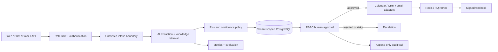

# ServicePilot AI

> An auditable AI service-operations agent that turns unstructured customer requests into safe, human-approved service plans.

[](https://github.com/hunterinvariants/servicepilot-ai/actions/workflows/ci.yml)

**Live application:** [servicepilot.hunter-mvp.com](https://servicepilot.hunter-mvp.com)

ServicePilot AI is deliberately not a chatbot wrapper. It classifies and structures incoming work, recommends a technician and appointment, drafts a quote and response, and stops at a human approval boundary before consequential actions occur.

## Production capabilities

- Multi-channel intake via web form and versioned REST API
- OpenAI-compatible, local-model, and deterministic demo providers
- Structured classification, urgency, confidence, and risk extraction
- Knowledge retrieval retained alongside the AI decision
- Prompt-injection detection, life-safety escalation, and restricted tool execution
- Organization-scoped data access, session authentication, API keys, and admin/operator RBAC
- Human approval before calendar, CRM, email, or webhook execution
- Provider-neutral calendar, SMTP, CRM, and signed-webhook adapters
- PostgreSQL persistence, Alembic migrations, and append-only audit enforcement
- Redis/RQ background processing with retries
- Usage, cost, latency, and evaluation-accuracy endpoints
- Request and login rate limits, security headers, environment-backed secrets, and signed outbound webhooks
- PDF quotes, demo data, Docker Compose, CI, and automated tests

## Architecture



The AI may propose; it cannot confirm a booking, send a quote, or execute an external business action. Customer content remains data, never instructions.

## Run locally

```bash
copy .env.example .env
docker compose up --build -d
docker compose exec web python -m scripts.seed
```

Open [localhost:8000](http://localhost:8000). API documentation is at `/docs`; health status is at `/health`. Change `ADMIN_PASSWORD`, `SECRET_KEY`, `API_KEY`, and `WEBHOOK_SIGNING_SECRET` before exposing an instance.

For a lightweight development run:

```bash
python -m venv .venv
.venv/Scripts/activate
pip install -r requirements-dev.txt
alembic upgrade head
python -m scripts.seed
uvicorn app.main:app --reload
```

## AI providers

The default `AI_PROVIDER=mock` is safe, deterministic, and credential-free. For an OpenAI-compatible or local inference API:

```env
AI_PROVIDER=openai-compatible
OPENAI_API_KEY=...
OPENAI_BASE_URL=https://api.openai.com/v1
OPENAI_MODEL=gpt-4.1-mini
```

Model output is schema-validated. Provider failure never expands business-action permissions.

## REST example

```bash
curl -X POST https://servicepilot.hunter-mvp.com/api/v1/intakes \
  -H "Content-Type: application/json" \
  -H "X-API-Key: $SERVICEPILOT_API_KEY" \
  -d '{"name":"Alex Morgan","email":"alex@example.com","address":"12 Main Street, Zurich","message":"The kitchen pipe is leaking under the sink.","source":"api"}'
```

## Deployment

The production stack runs from `/home/user/servicepilot-ai` and is exposed through a token-managed Cloudflare Tunnel:

```bash
git clone https://github.com/hunterinvariants/servicepilot-ai.git /home/user/servicepilot-ai
cd /home/user/servicepilot-ai
cp .env.example .env
docker compose -f docker-compose.yml -f compose.production.yml -f docker-compose.cloudflare.yml up --build -d
docker compose exec web python -m scripts.seed
```

The tunnel route maps `servicepilot.hunter-mvp.com` to `http://web:8000`. Secrets stay in the server-side `.env` file and are never committed.

## Verification

```bash
pip install -r requirements-dev.txt
python -m ruff check app tests scripts alembic
python -m alembic upgrade head
python -m pytest --cov=app
docker build -t servicepilot-ai .
```

## License

MIT
