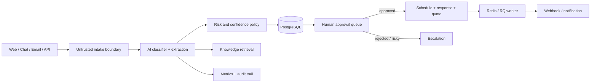

# ServicePilot AI

> An auditable AI service-operations agent that turns unstructured customer requests into safe, human-approved service plans.

[](https://github.com/hunterinvariants/servicepilot-ai/actions/workflows/ci.yml)

ServicePilot AI is deliberately not a chatbot wrapper. It classifies and structures incoming work, recommends a technician and appointment, drafts a quote and response, and then stops at a human approval boundary before consequential actions occur.

## What the demo proves

- Multi-channel intake via web form and REST API (with email/chat adapter-ready source fields)
- Provider abstraction for OpenAI-compatible APIs, local endpoints, and deterministic offline demos
- Structured classification, urgency, confidence, and risk extraction
- Lightweight knowledge retrieval with source data retained in the audit event
- Prompt-injection detection and life-safety escalation
- Restricted action workflow with explicit human approval
- CRM/service dashboard, technician matching, quote PDF generation, and customer response drafts
- PostgreSQL persistence, Redis/RQ background jobs with retries, and webhook integration
- AI latency/token/cost event model and immutable-style decision history
- Docker Compose, automated tests, CI, demo data, and production reverse-proxy guidance

## Architecture



The AI may propose; it cannot independently confirm a booking, send a quote, or execute an external business action. Customer content remains data, not instructions. Hazard keywords, prompt-injection patterns, low confidence, and high urgency produce escalation flags.

## Run locally

Requirements: Docker Desktop and Docker Compose.

```bash
copy .env.example .env
docker compose up --build -d
docker compose exec web python -m scripts.seed
```

Open [http://localhost:8000](http://localhost:8000). API documentation is at `/docs`, and health status at `/health`.

For a lightweight SQLite development run:

```bash
python -m venv .venv
.venv/Scripts/activate
pip install -r requirements-dev.txt
python -m scripts.seed
uvicorn app.main:app --reload
```

On Linux/macOS, activate with `source .venv/bin/activate`.

## AI providers

The default `AI_PROVIDER=mock` is safe, deterministic, and needs no credentials. To use an OpenAI-compatible or local inference API, set:

```env
AI_PROVIDER=openai-compatible
OPENAI_API_KEY=...
OPENAI_BASE_URL=https://api.openai.com/v1
OPENAI_MODEL=gpt-4.1-mini
```

For a compatible local server, use its base URL and key convention. Model output is schema-validated; provider errors do not grant fallback permissions for business actions.

## REST example

```bash
curl -X POST http://localhost:8000/api/v1/intakes \
  -H "Content-Type: application/json" \
  -d '{"name":"Alex Morgan","email":"alex@example.com","address":"12 Main Street, Zurich","message":"The kitchen pipe is leaking under the sink.","source":"api"}'
```

The response includes a ticket reference, state, risk flags, and `approval_required: true`.

## Production deployment target

The intended host path and public domain are deployment targets; they do not need to exist before development:

- Ubuntu path: `/home/user/servicepilot-ai`
- Public URL: `https://servicepilot.hunter-mvp.com`
- Repository: `hunterinvariants/servicepilot-ai`

On the Ubuntu host:

```bash
git clone https://github.com/hunterinvariants/servicepilot-ai.git /home/user/servicepilot-ai
cd /home/user/servicepilot-ai
cp .env.example .env
# Set a strong SECRET_KEY and production credentials in .env
docker compose -f docker-compose.yml -f compose.production.yml up --build -d
docker compose exec web python -m scripts.seed
```

Point a Cloudflare DNS record for `servicepilot.hunter-mvp.com` at the server or configure a Cloudflare Tunnel using [`deploy/cloudflared.example.yml`](deploy/cloudflared.example.yml). The production override binds the app only to loopback; use Caddy/Nginx or the tunnel to provide TLS. Do not commit `.env` or tunnel credentials.

## Verification

```bash
pip install -r requirements-dev.txt
ruff check app tests scripts
pytest --cov=app
docker compose config
docker build -t servicepilot-ai .
```

## Repository boundaries

This is a standalone application and deployment. It does not import, modify, or share runtime state with OrderFlow Integrator.

## Roadmap

- OAuth/RBAC and tenant isolation before real customer use
- Alembic migrations and append-only audit storage
- Calendar, SMTP, and CRM adapters behind the approval executor
- Evaluation datasets and production accuracy/cost dashboards
- Signed inbound webhooks, rate limits, and secret-manager integration

## License

MIT

